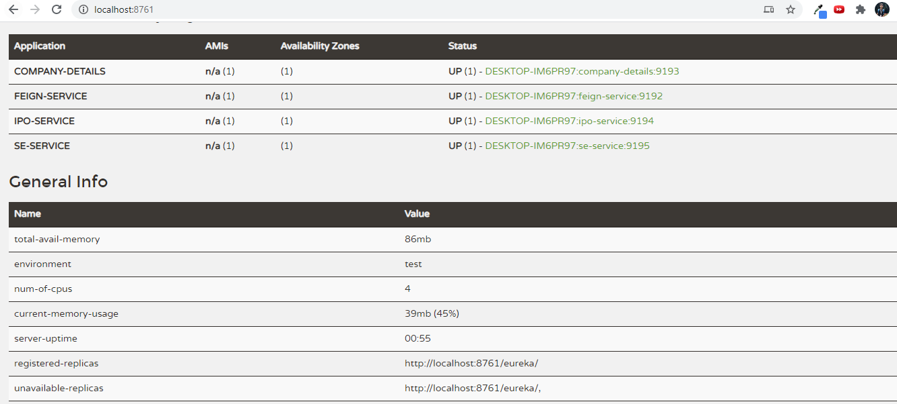

# Stock App
Phase3 Stock Application

## Microservices Names-
### 1. feign-service
#### Endpoints- 
- feign/{compId}   
  Method - GET  
  Returns company with company ID
- feign/matching/{compName}  
  Method - GET  
  Returns list of companies with company Name pattern
- feign/ipos/{compName}  
  Method - GET  
  Returns ipo with given company Name
- feign/sector/{compName}  
  Method - GET  
  Returns sector with given company Name
- feign/se/{se}
  Method - GET  
  Returns list of companies with given Stock Exchange
- feign/se-service/{seId}
  Method - GET  
  Returns the Stock Exchange object with the given seId
- feign/se-service
  Method - GET  
  Returns list of all Stock Exchange object
- feign/add  
  Method - POST  
  Add the company details to the database
- feign/se-service/  
  Method - POST  
  Add the stock exchange details to the database
#### SWAGGER Screenshots-

### 2. Eureka Discovery Service-
#### Screenshots- 

### 3. company-details
#### Endpoints-
- companies/{compId}  
  Method - GET  
  Returns company with company ID
- companies/matching/{compName}  
  Method - GET  
  Returns list of companies with company Name pattern
- companies/sector/{sector}  
  Method - GET  
  Returns list of companies in given sector
- companies/se/{se}
  Method - GET  
  Returns list of companies with given Stock Exchange
- companies/add  
  Method - POST  
  Add the company details to the database
#### SWAGGER Screenshots- 

### 4. ipo-service
#### Endpoints-
- ipos/{compId}  
  Method - GET  
  Returns list of ipos using company ID
#### SWAGGER Screenshots-

### 5. se-service
#### Endpoints-
- /se/{seId}  
  Method - GET  
  Returns the Stock Exchange object with the given seId
- /se/  
  Method - POST  
  Add the stock exchange details to the database
- /se  
  Method - GET  
  Returns list of all Stock Exchange object
#### SWAGGER Screenshots-  

### 6. ADMIN Server
#### Screenshots- 

### 7. config-server

### 8. ZIPKIN-
- JAR Link- https://drive.google.com/file/d/1cIAdvxKvXb9Uqv6b4Edce7aCfD1042_k/view?usp=sharing
#### Screenshots- 

### SWAGGER In Action-

## DEPLOYMENT (AWS)-
- Link- http://stockappcompanydetails-env.eba-ezmrrzpn.ap-south-1.elasticbeanstalk.com/companies/100
- Swagger Link - http://stockappcompanydetails-env.eba-ezmrrzpn.ap-south-1.elasticbeanstalk.com/swagger-ui.html

## USER INTERFACE (Angular)-  
#### Stock Exchange List Page

#### Add Stock Exchange Page

#### Update Stock Exchange List Page  

## JMeter Testing Screenshots  

  
   

  
   

  

## Docker  
Docker implementation of company-service.
- DockerHub link to run the service- docker pull anshul16/company-details  
- Port used-5000
- Use http://localhost:5000/swagger-ui.html to run on local machine.
#### Screenshot

